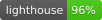

# Admin Dashboard MVP

Production-ready Next.js admin template for shipping B2B dashboards fast. Opinionated defaults, 100% TypeScript, and mock data so you can demo value in minutes.

[](LICENSE)
[](https://github.com/stupidkubik/Admin-Dashboard-MVP/actions/workflows/ci.yml)
[](https://codecov.io/gh/stupidkubik/Admin-Dashboard-MVP)



---

## Demo

- **Local preview**: `npm run dev` → open `http://localhost:3000`
- **Screens**: Dashboard overview, Users table with CRUD patterns, Forms with validation, Settings with theme toggle
- **Test data**: Served from `/app/api/*` handlers and `mocks/data/*.json`

## Features

- Ready-made layouts with sidebar navigation, header actions, breadcrumbs, and responsive breakpoints
- Dashboard widgets with charts, KPIs, recent activity, skeletons, and error states out of the box
  

- User management table built on TanStack Table with sorting, pagination, bulk select, and action menus
- Auth starter pack (login, register, forgot password) wired to mock endpoints for instant demos
  
  
- Form patterns using React Hook Form + Zod, including validation messaging and toast feedback
- Theme system (light/dark) powered by next-themes and Tailwind CSS tokens
- Built-in internationalization with locale persistence, header switcher, and translations for English, Spanish, French, and Russian
  

- Toast notifications, modals, and async states powered by reusable UI primitives (shadcn/ui + custom components)
- Mock API routes and MSW helpers to switch between fake data and a real backend without refactors

## Tech Stack

- **Framework**: Next.js App Router (15.x) + React 19  
- **Language**: TypeScript with absolute imports and path aliases  
- **Styling**: Tailwind CSS 4, tailwindcss-animate, shadcn/ui component patterns  
- **Data Layer**: RTK Query (dashboard/users), TanStack Table, Zod schemas, Zustand-ready contexts  
- **Tooling**: ESLint, Prettier, Jest + Testing Library, MSW for API mocking  
- **Charts & UI Enhancements**: Chart.js with `react-chartjs-2`, lucide-react icons, Sonner toasts  

## Structure

```
app/
  layout.tsx          # Root layout, theme + shell providers
  page.tsx            # Landing redirect to dashboard
  dashboard/          # KPI widgets, charts, activity feed
  users/              # CRUD table, bulk actions, detail drawer
  forms/              # Demo forms with validation patterns
  settings/           # Profile + preferences + theme toggle
  auth/               # Login, register, forgot-password flows
  api/                # Mocked REST endpoints (users, stats, auth)
components/
  common/, dashboard/, data-table/, layout/, ui/ primitives
contexts/             # Theme + sidebar providers
lib/                  # Hooks, types, utilities, validation schemas
mocks/                # MSW handlers and JSON fixtures
public/               # Static assets, mockServiceWorker
styles/, tailwind.config.ts, eslint.config.mjs, jest.config.js
```

## Setup (≤10 minutes)

1. **Prerequisites**: Node.js 18+ and npm 9+.
2. **Install** (`~3 min`): `npm install`
3. **Run** (`~1 min`): `npm run dev` and open `http://localhost:3000`
4. **Optional**: `npm run test` for unit tests, `npm run lint` to enforce coding standards.

> Tip: No environment variables are required for local demo. Set `NEXT_PUBLIC_API_BASE_URL="https://your-api.example.com"` to target a remote service and `NEXT_PUBLIC_API_MOCKING=disabled` if you want to opt out of MSW entirely.

## Internationalization

- The shell bootstraps `LocaleProvider` and `LocaleSwitcher` so every page automatically loads the active language and persists your selection to `localStorage`/cookies.
- Copy for four locales ships in [`/locales`](locales) (`en`, `es`, `fr`, `ru`). Use the `t()` helper from `useLocale()` to read nested keys with optional fallbacks.
- Add or edit translations by updating each locale file. New pages should register strings under a dedicated namespace (for example `reports.page.title`).
- When introducing a new language, extend `SUPPORTED_LOCALES` in [`lib/i18n.ts`](lib/i18n.ts) and provide a dictionary export in `locales/<code>.ts`.

## Customize

- **Branding & theme**: Update design tokens in `app/globals.css` and Tailwind config; see [`docs/theming.md`](docs/theming.md).
- **Navigation & layout**: Adjust shell components in `components/layout/*` (sidebar, header, breadcrumbs) and register new items via `constants/nav.ts`.
- **Data & validation**: Modify schemas in `lib/validators`, extend RTK Query endpoints in `lib/apiSlice`, and update mocks under `mocks/data`.
- **UI primitives**: Extend the React components in `components/ui` or scaffold new ones following the same API surface.

## Guides

- **Add a new page**: Follow the step-by-step checklist in [`docs/creating-pages.md`](docs/creating-pages.md).
- **Component catalogue**: Browse props and usage notes in [`docs/components.md`](docs/components.md).
- **Advanced forms**: Learn how `react-hook-form` and Zod fit together in [`docs/forms.md`](docs/forms.md).
- **Theming**: Customize colors, typography, and spacing tokens using [`docs/theming.md`](docs/theming.md).

## Mock API

- Development requests hit Next.js route handlers under `app/api` backed by JSON fixtures in `mocks/data`.
- MSW browser worker (`mocks/browser.ts`) mirrors the same handlers for component testing and story demos and automatically skips registration when `NEXT_PUBLIC_API_BASE_URL` points to anything other than the default `/api` path (including absolute URLs).
- Toggle behavior with `NEXT_PUBLIC_API_MOCKING` or by removing `<MockServiceWorker />` from the app shell when deploying with real services.

## FAQ

**How do I connect to a real backend?** Set `NEXT_PUBLIC_API_BASE_URL` to your server (for example `https://api.example.com/v1`) so the shared fetcher resolves requests against it. You can keep the MSW mocks disabled automatically via that setting or remove the route handlers entirely when you're ready.

**Can I deploy this to Vercel or another host?** Yes—run `npm run build` then deploy. The project uses standard Next.js build output.

**How do I add new locales or copy?** Duplicate resource files in `locales/` and wire them into your pages/components via the i18n helpers in `lib/i18n`.

**Is authentication production-ready?** The auth screens ship with mock handlers. Plug in your auth provider (Cognito, Auth0, custom) by replacing `app/api/auth/route.ts` and wiring the forms to your endpoints.

## Changelog

### 1.1.0 — 2026-01-16

- Switched dashboard and users data fetching to RTK Query with a simplified `/api` base
- Removed SSR preloading of the store to avoid hydration drift; client queries refetch on mount
- Cleaned out temporary debug logging and direct fetch probes

### 1.0.0 — 2025-09-21

- Initial buyer-ready release with refreshed README, quick-start instructions, and FAQ
- Added structured documentation for demo, features, setup, customization, and mock API usage
- Documented v1 component set (dashboard, users, forms, settings, auth) and tooling baseline

---

Need implementation details beyond the README? Check the `/docs` folder for component API, forms, and theming guides.
